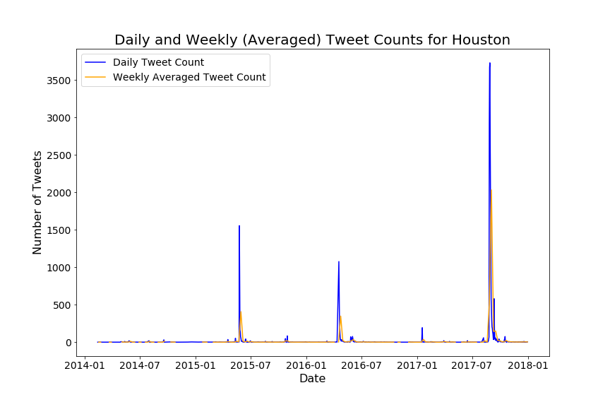
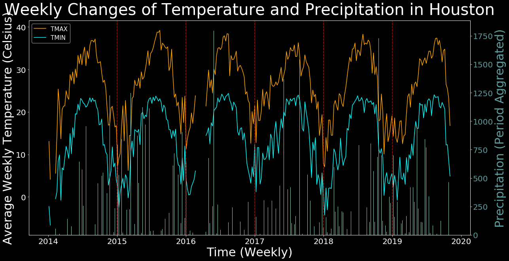

# Leveraging Social Media and NOAA Weather Data to Identify Major Historic Flood Events

## Problem Statement
Floods are one of the most frequent natural disasters, which threaten human and animal life as well as cause significant damage to cities' infrastructure. In order to effectively equip cities to anticipate floods, a deep analysis on vulnerabilties of cities is needed. That said, the impact of major floods on particular cities is difficult to determine due to there being minimal tools accessible to the public that can effectively identify major flood events on a global scale. This study aims to create an open-source tool to identify historical flood events based on data extracted from Twitter and international weather stations.

### Team Members
* [Angeline Lee](https://www.linkedin.com/in/angelinevlee/)
* [Chana Tilevitz](https://www.linkedin.com/in/chanatilevitz/)
* [David Li](https://www.linkedin.com/in/davidgnli/)

### Project Files in order of workflow
1. [Twitter Scraper](./code/twitter_scraper.ipynb)
2. [Twitter EDA and More](./code/twitt_EDA_and_more.ipynb)
3. [Weather Collection](./code/POAA%20Data%20Collection.ipynb)
4. [Slide Presentation](./flooding_impact_in_social_media.pdf)

## Executive Summary
We knew Twitter would provide categorical information related to flood disasters. As a way to assess relevant and insightful tweets from unhelpful tweets(i.e. noise), we designated a developed city (Houston, TX) and a developing city (Manila, Philippines) as our use cases. Because floods are prevalent in different types of regions, it was important to choose two cities that could reflect this difference in addition to transcending cultural frames of reference. The locations of the cities were extracted based on keywords and hashtags found in tweets.

After scraping over 30,000 tweets and taking a close look at how people tweeted during flood disasters, we found that the frequency of tweets was not always directly correlated to the impact of a flood. We explored the tweets using Lemmatization and K-Means Clustering, however, no meaningful results were detected and so these findings were opted out of the notebooks. This led us to pursue weather data as an objective viewpoint to analyze alongside the user generated tweets.

> Houston Tweet Spikes

By leveraging the cdo_api_py, we scraped official weather information from NOAA. We created a flexible function(get_weather) that utilizes several parameters in order to find the desired data. Our function is able to highlight key weather information on a given region within a given date range. Based on geographic locations, we were able to create a tool that helps easily collect a clean Pandas DataFrame and create clean visualizations. For instance, a weather graph from Houston including mapping of the high temperature, low temperature and precipitation look like the blow:

> Houston precipitation and Temperature (Dark Background)

We realized that there could be multiple weather stations in close proximity to one another and therefore we decided to group the data by date and averaged the temperature along with the precipitation collected from those weather stations.

## Conclusion and Next Steps
We were able to create an efficient and accessible tool, however, due to the limited time constraint, our tool is merely a jumping off point that may be expanded upon. As we discovered, the use of Twitter is not uniform across continents and thus performing sentiment analysis on tweets would produce a more in depth understanding regarding tone and language. It's important to note that the level of impact a flood may have is relative to the frequency in which a city experiences flood events. For example, floods happened more often in Manila than Houston and so people may not feel as inclined to report on every flood even if the flood causes significant damages. Furthermore, sourcing from other social media platforms such as news sources that are region-specific would prove useful in discerning the number of deaths, injuries, displacements, etc, a flood event inflicted. Also, our tool may be further enhanced by integrating with the considerable amount of flood event data available to government disaster agencies. Finally, our product can be used to inform the selection of satellite imagery: once the dates of a particular flooding event have been identified, satellite photos from before and after the event can be used to identify the effects of the flood on a much more specific scale, down to the neighborhood level.

### Source Documentation
* [National Oceanic and Atmospheric Administration](https://www.noaa.gov/weather)
* [Houston Disaster That Wasn't](https://www.houstonpublicmedia.org/articles/news/2017/06/22/205744/the-storm-that-wasnt/)
* [Houston Flood 2014](http://floodlist.com/america/usa/thunderstorm-flash-floods-houston-texas)
* [Houston Flood 2015](http://floodlist.com/america/usa/texas-floods-6-killed-after-storms-sweep-through-austin-and-houston)
* [Manila Flood 2014](https://center.noah.up.edu.ph/habagat-2014-flood-marikina-city/)
* [Manila Flood 2016](http://floodlist.com/asia/philippines-floods-manila-central-luzon-calabarzon-august-2016)
* [Manila Flood 2017](https://www.rappler.com/move-ph/issues/disasters/181867-flooded-areas-metro-manila-september-12)
